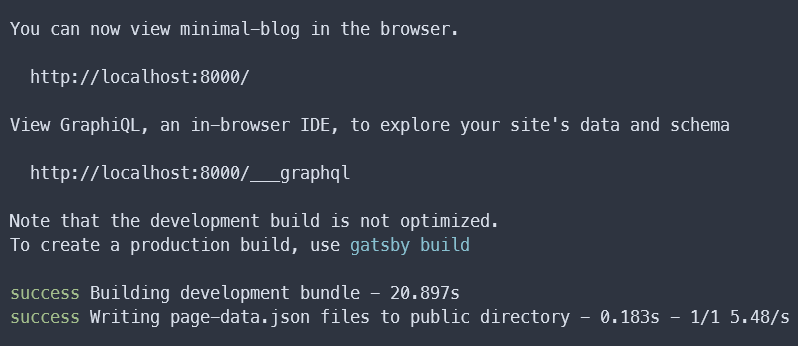
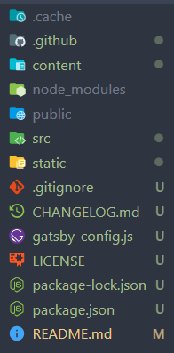

## 前言

主要會想從 Hexo 轉移到 Gatsby 有幾個原因。

1. 之前利用 Hexo 所建立的網站，已經許久沒有更新了，因此想透過這次機會整理一下。
2. 由於前陣子學習了 React 框架，而 Gatsby 又是基於此所開發的。

> 可以 [點擊連結](https://willy14620.github.io/) 前往我的部落格查看成果。

## 安裝

與 Hexo 一樣先安裝 Gatsby 的 cli。

```shell
# npm
npm install gatsby-cli -g

# yarn
yarn add gatsby-cli global
```

## 建構專案

透過 `gatsby new` 指令可以自動產生專案，前方的 `{your-project-name}` 是你的專案名稱；

而後方的 `{link-to-starter}` 是在 Github 上開源的各種 starters，

可以至 Gatsby Starter Library 找尋自己喜愛的樣式。
而我是選擇 LekoArts 所開發的 minimal-blog 主題。

```shell
gatsby new {your-project-name} {link-to-starter}
```

將 starter 以及依賴的套件都安裝完後，就可以 run 看看了。

```shell
cd blog
npm run develop
```

> 這裡我使用 `blog` 來代替專案名稱。



> 看到這個畫面代表已經成功啟動專案，可以透過瀏覽器至 localhost:8000 預覽！

## 設定

要了解一個專案，首先就要從目錄開始看起。下方只會介紹會修改到的目錄。



- `content/pages`：網站的各種 pages。
- `content/posts`：放置撰寫的所有文章。
- `src/gatsby-theme-minimal-blog/texts`：首頁的各種 sections。
- `pages`：與 `content/pages` 相似。
- `public`：也就是開發完後要上傳至 Github 的靜態檔案。
- `static`：一些靜態檔案，像是網站的 icon、banner 等。
- `gatsby-config.js`：gatsby 設定的地方，plugins 也是經由此檔案來引用的，

參考上方的目錄說明，就可以開始修改你個人的專案了。

## 部署

當設定完所有的東西後，接著就要將檔案部署到 Github 的 gh-pages 上了，
這裡我們會透過安裝 `gh-pages` 套件來完成。

```shell
# npm
npm install gh-pages -D

# yarn
yarn add gh-pages -D
```

接著到 `package.json` 檔案增加下方的指令。

```json
"scripts": {
  "deploy": "gatsby build --prefix-paths  && gh-pages -d public -b master"
}
```

最後使用終端機執行 `npm run deploy` 指令，完成後就可以到 `<username>.github.io` 查看成果了。

---

## 結語

藉由本次的機會讓我對於 Gatsby 有更多的了解，同時也學習了不少新知識，像是 MDX 檔案、GraphQL 等等。

後續有機會的話會在深入學習 Gatsby 框架，並嘗試製作屬於自己的 starter，不過想必可能會花費許多時間研究。

---

## 參考文章

- [Gatsby Starter Library](https://www.gatsbyjs.com/starters/?v=2)
- [Gatsby | 不是木村拓哉也能玩轉 Gatsby — feat. GitHub Pages](https://medium.com/starbugs/gatsby-%E4%B8%8D%E6%98%AF%E6%9C%A8%E6%9D%91%E6%8B%93%E5%93%89%E4%B9%9F%E8%83%BD%E7%8E%A9%E8%BD%89-gatsby-feat-github-pages-fe2318a2e50d)
- [minimal-blog](https://www.gatsbyjs.com/starters/LekoArts/gatsby-starter-minimal-blog/)
- [MDX](https://www.mdxjs.cn/)
